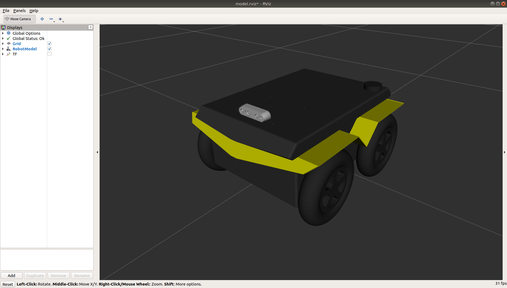
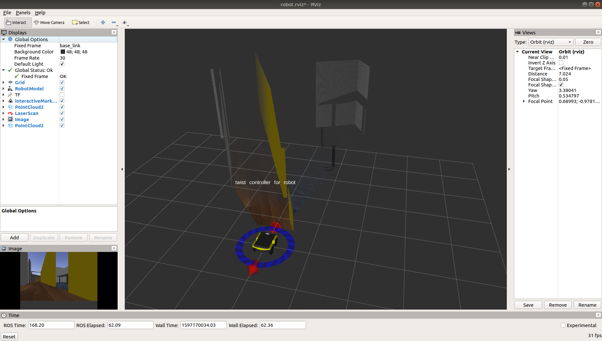

Additional Simulation Worlds
================================

In addtion to the default ``jackal_world.launch`` file, ``jackal_gazebo`` contains three additional launch files:

* ``empty_world.launch``, which spawns Jackal in a featureless, infinite plane;
* ``hrtac_world.launch``, which is a scenario from the HRTAC_ competition; and
* ``spawn_jackal.launch``, which is intended to be included in any custom world to add a Jackal simulation to it.

.. _HRTAC: https://github.com/phir2-lab/hratc2017_framework

.. image:: images/jackal_hrtac_world.png
  :alt: Jackal in the HRTAC world

To add a Jackal to any of your own worlds, simply include the ``spawn_jackal.launch`` file in your own world's launch:

.. code-block:: xml

  <include file="$(find jackal_gazebo)/launch/spawn_jackal.launch">
    <!-- Optionally configure the spawn position -->
    <arg name="x" value="$(arg x)"/>
    <arg name="y" value="$(arg y)"/>
    <arg name="z" value="$(arg z)"/>
    <arg name="yaw" value="$(arg yaw)"/>
  </include>

Finally, Clearpath provides an additional suite of simulation environments that can be downloaded separately and used
with Jackal, as described below.

Clearpath Gazebo Worlds
------------------------

The Clearpath Gazebo Worlds collection contains 4 different simulation worlds, representative of different
environments our robots are designed to operate in:

* Inspection World: a hilly outdoor world with water and a cave
* Agriculture World: a flat outdoor world with a barn, fences, and solar farm
* Office World: a flat indoor world with enclosed rooms and furniture
* Construction World: office world, under construction with small piles of debiris and partial walls

Jackal is supported in all four environments.

Installation
---------------

To download the Clearpath Gazebo Worlds, clone the repository from github into the same workspace as your Jackal:

.. code-block:: bash

  cd ~/catkin_ws/src
  git clone https://github.com/clearpathrobotics/cpr_gazebo.git

Before you can build the package, make sure to install dependencies.  Because Clearpath Gazebo Worlds depends on
all of our robots' simulation packages, and some of these are currently only available as source code, installing
dependencies with ``rosdep install --from-paths [...]`` will likely fail.

All four simulation environments need the ``gazebo_ros`` package.  The Inspection World also needs the ``uuv_gazebo_worlds``
package, which can be installed by running

.. code-block:: bash

  sudo apt-get install ros-$ROS_DISTRO-uuv-gazebo-worlds

Once the dependencies are installed, you can build the package:

.. code-block:: bash

  cd ~/catkin_ws
  catkin_make
  source devel/setup.bash

Running the Inspection Simulation
------------------------------------

Inspection World is a hilly, outdoor world that includes a water feature, bridge, pipeline, small cave/mine,
and a small solar farm.  It is intended to simulate a variety of missions, including pipeline inspection,
cave/underground navigation, and localization on non-planar terrain.

.. image:: images/jackal_inspection_bridge.png
  :alt: Jackal driving over the bridge in the inspection world

To launch the inspection simulation, run

.. code-block:: bash

  roslaunch cpr_inspection_gazebo inspection_world.launch platform:=jackal

To customize Jackal's payload, for example to add additional sensors, see :ref:`customizepayload`.

Once the simulation is running you can use rviz and other tools as described in :doc:`simulation` and :doc:`navigation`
to control and monitor the robot.  For example, below we can see Jackal exploring the cave:

.. image:: images/jackal_inspection_cave.png
  :alt: Jackal exploring the cave

and Jackal's perception of the inside of the cave as a 3D pointcloud in rviz:

.. image:: images/jackal_rviz_inspection_cave.png
  :alt: Jackal in rviz exploring the cave

You can see the complete layout of the Inspection World below:

.. image:: images/inspection_world.png
  :alt: Inspection World

Running the Agriculture Simulation
------------------------------------

Agriculture World is a flat, mixed indoor/outdoor world that include a large barn, open fields surrounded by fences,
and a large solar farm.  It is intended to simulate missions such as solar panel inspection and area coverage.

.. image:: images/jackal_agriculture_world.png
  :alt: Jackal in the agriculture world

To launch the agriculture simulation, run

.. code-block:: bash

  roslaunch cpr_agriculture_gazebo agriculture_world.launch platform:=jackal

To customize Jackal's payload, for example to add additional sensors, see :ref:`customizepayload`.

Once the simulation is running you can use rviz and other tools as described in :doc:`simulation` and :doc:`navigation`
to control and monitor the robot.

.. image:: images/agriculture_world.png
  :alt: Agriculture World

Running the Office Simulation
--------------------------------

Office World is a small indoor environment representing a commercial office space.  It features several large, open
areas with furniture, as well as a narrow hallway with smaller offices and meeting rooms.  It is intended to simulate
missions in commercial spaces, such as facilitating deliveries, security monitoring, and inspecting equipment.

.. image:: images/jackal_office_world.png
  :alt: Jackal in the Office World

To launch Office World with a Jackal, run the following command:

.. code-block:: bash

  roslaunch cpr_office_gazebo office_world.launch platform:=jackal

To customize Jackal's payload, for example to add additional sensors, see :ref:`customizepayload`.

Once the simulation is running you can use rviz and other tools as described in :doc:`simulation` and :doc:`navigation`
to control and monitor the robot. For example, below we can see the ``gmapping_demo`` from ``jackal_navigation`` being
used to build a map of the office world:

.. image:: images/jackal_rviz_office_gmap.png
  :alt: Jackal building a map of the office with gmapping

You can see the complete layout of the office world below:

.. image:: images/office_world.png
  :alt: Office World

Running the Construction Simulation
--------------------------------------

Construction World is the same basic layout as Office World, representing the same office space under construction/rennovation.
It is an indoor environment with small hills of debris/rubble, partial walls, and piles of construction supplies.  It
is designed to simulate missions in any sort of construction site.

.. image:: images/jackal_construction_world.png
  :alt: Jackal in the Construction World

To launch Construction World with a Jackal, run the following command:

.. code-block:: bash

  roslaunch cpr_office_gazebo office_construction_world.launch platform:=jackal

To customize Jackal's payload, for example to add additional sensors, see :ref:`customizepayload`.

Once the simulation is running you can use rviz and other tools as described in :doc:`simulation` and :doc:`navigation`
to control and monitor the robot.

You can see the complete layout of the office below:

.. image:: images/construction_world.png
  :alt: The layout of Construction World

.. _customizepayload:

Customizing Jackal's Payload
-------------------------------

To customize Jackal's payload you must use the environment variables described in :doc:`description`.  For example,
to equip Jackal with a Sick LMS-1xx lidar, as pictured in several of the images above, run

.. code-block:: bash

  export JACKAL_LASER=1

before launching the simulation world.

You can also add additional sensors by creating a customized URDF and setting the ``JACKAL_URDF_EXTRAS`` environment
variable to point to it.

For example, let's suppose you want to equip Jackal with an Intel RealSense D430 camera.  First, install the ``realsense2_camera``
and ``realsense2_description`` packages, along with the gazebo plugins:

.. code-block:: bash

  sudo apt-get install ros-$ROS_DISTRO-realsense2-camera ros-$ROS_DISTRO-realsense2-description ros-$ROS_DISTRO-gazebo-plugins

Then create your customized URDF file, for example ``$HOME/Desktop/realsense.urdf.xacro``.  Put the following in it:

.. code-block:: xml

  <?xml version="1.0"?>
  <robot xmlns:xacro="http://ros.org/wiki/xacro">

    <link name="front_realsense" />

    <!--
      The gazebo plugin aligns the depth data with the Z axis, with X=left and Y=up
      ROS expects the depth data along the X axis, with Y=left and Z=up
      This link only exists to give the gazebo plugin the correctly-oriented frame
    -->
    <link name="front_realsense_gazebo" />
    <joint name="front_realsense_gazebo_joint" type="fixed">
      <parent link="front_realsense"/>
      <child link="front_realsense_gazebo"/>
      <origin xyz="0.0 0 0" rpy="-1.5707963267948966 0 -1.5707963267948966"/>
    </joint>

    <gazebo reference="front_realsense">
      <turnGravityOff>true</turnGravityOff>
      <sensor type="depth" name="front_realsense_depth">
        <update_rate>30</update_rate>
        <camera>
          <!-- 75x65 degree FOV for the depth sensor -->
          <horizontal_fov>1.5184351666666667</horizontal_fov>
          <vertical_fov>1.0122901111111111</vertical_fov>

          <image>
            <width>640</width>
            <height>480</height>
            <format>RGB8</format>
          </image>
          <clip>
            <!-- give the color sensor a maximum range of 50m so that the simulation renders nicely -->
            <near>0.01</near>
            <far>50.0</far>
          </clip>
        </camera>
        <plugin name="kinect_controller" filename="libgazebo_ros_openni_kinect.so">
          <baseline>0.2</baseline>
          <alwaysOn>true</alwaysOn>
          <updateRate>30</updateRate>
          <cameraName>realsense</cameraName>
          <imageTopicName>color/image_raw</imageTopicName>
          <cameraInfoTopicName>color/camera_info</cameraInfoTopicName>
          <depthImageTopicName>depth/image_rect_raw</depthImageTopicName>
          <depthImageInfoTopicName>depth/camera_info</depthImageInfoTopicName>
          <pointCloudTopicName>depth/color/points</pointCloudTopicName>
          <frameName>front_realsense_gazebo</frameName>
          <pointCloudCutoff>0.105</pointCloudCutoff>
          <pointCloudCutoffMax>8.0</pointCloudCutoffMax>
          <distortionK1>0.00000001</distortionK1>
          <distortionK2>0.00000001</distortionK2>
          <distortionK3>0.00000001</distortionK3>
          <distortionT1>0.00000001</distortionT1>
          <distortionT2>0.00000001</distortionT2>
          <CxPrime>0</CxPrime>
          <Cx>0</Cx>
          <Cy>0</Cy>
          <focalLength>0</focalLength>
          <hackBaseline>0</hackBaseline>
        </plugin>
      </sensor>
    </gazebo>

    <link name="front_realsense_lens">
      <visual>
        <origin xyz="0.02 0 0" rpy="${pi/2} 0 ${pi/2}" />
        <geometry>
          <mesh filename="package://realsense2_description/meshes/d435.dae" />
        </geometry>
        <material name="white" />
      </visual>
    </link>

    <joint type="fixed" name="front_realsense_lens_joint">
      <!-- Offset the camera 5cm forwards and 1cm up -->
      <origin xyz="0.05 0 0.01" rpy="0 0 0" />
      <parent link="front_mount" />
      <child link="front_realsense_lens" />
    </joint>
    <joint type="fixed" name="front_realsense_joint">
      <origin xyz="0.025 0 0" rpy="0 0 0" />
      <parent link="front_realsense_lens" />
      <child link="front_realsense" />
    </joint>
  </robot>

This file defines the additional links for adding a RealSense camera to the robot, as well as configuring the ``openni_kinect``
plugin for Gazebo to simulate data from a depth camera.  The camera itself will be connected to the Jackal's ``front_mount``
link, offset 5cm towards the front of the robot.

Now, set the ``JACKAL_URDF_EXTRAS`` environment variable and try viewing the Jackal model:

.. code-block:: bash

  export JACKAL_URDF_EXTRAS=$HOME/Desktop/realsense.urdf.xacro
  roslaunch jackal_viz view_model.launch

You should see the Jackal model in rviz, with the RealSense camera mounted to it:

To launch the customized Jackal in any of the new simulation environments, similarly run:

.. code-block:: bash

  export JACKAL_URDF_EXTRAS=$HOME/Desktop/realsense.urdf.xacro
  roslaunch cpr_office_gazebo office_world.launch platform:=jackal

You should see Jackal spawn in the office world with the RealSense camera:

.. image:: images/jackal_office_realsense.png

You can view the sensor data from the RealSense camera by running

.. code-block:: bash

  roslaunch jackal_viz view_robot.launch

and adding the camera & pointcloud from the ``/realsense/color/image_raw`` and ``/realsense/depth/color/points`` topics:

