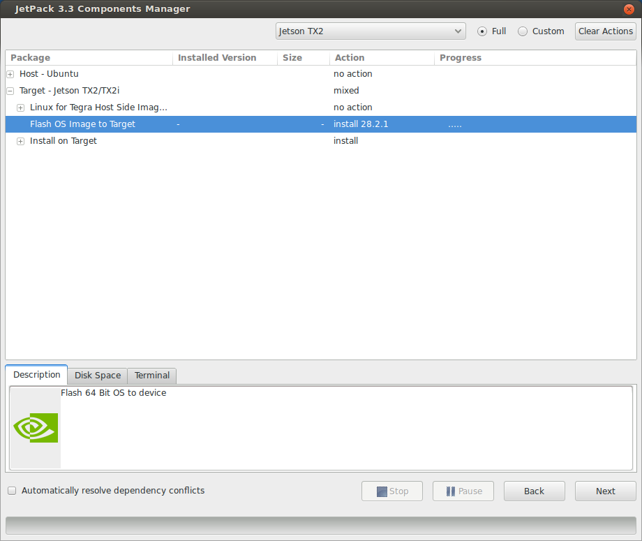

Installing a Jetson TX2 on a Jackal
=====================================

Start by opening up the Jackal to reveal the computer tray. Use the lever on the front of the Jackal then the thumb screws on the lid. For more instructions refer to the `Jackal User's Manual <http://bit.ly/1f4hmqP>`_.

Step 1: Remove mini-ITX Computer
--------------------------------

(Skip this step if you don't have a computer)

If you have a mini-ITX computer installed it will need to be removed. With the computer tray open locate each of the cables connected to the motherboard and harddrive. Remove the power, power switch, USB and SATA cables. The two cable ties can be cut to completely remove the power and SATA cables. The two antenna cables are connected underneath. Keep this in mind for the next steps.

.. image:: images/img1.JPG

Remove the four (4) hex screws from the motherboard using a 2.5mm wrench. Gently lift it out disconnecting the antenna connectors as you do so.

.. image:: images/img2.JPG

Remove the zipties holding the USB header, power switch signal and antenna wire. The Jetson TX2 doesn't have a USB header so it will have to be replaced with a USB mini cable. You will need extra slack in both the antenna cable and power switch signal as well.

.. image:: images/img3.JPG

Step 2: Install the TX2
------------------------
Install the Jetson TX2 using M3 screws or the screws removed from the computer. The holes will only line up in one orientation. Plug a USB mini cable from the Jetson to the Jackal MCU board.

.. image:: images/img4.JPG

This is beside where the USB header was removed if you had a computer. We recommend using a USB hub to increase the number of connected devices.  Plug the power switch cable into the power switch header (J6). If you wish to use the antenna cables attached to the Jackal remove the U.FL connectors from the Jetson module and connect the antenna cables. Caution: Take your time with this step the UF.L connectors are fragile.  If you wish not to disconnect the UF.L cables you can replace the antenna mounts on the Jackal with SMA extensions.

In order to power the Jetson make a cable which connects to the 12V user power to a barrel connector with center positive. Refer to the Jackal manual for the pinout of the user power. We used one of the molex user power connectors.

.. image:: images/img5.JPG

**Warning:** Make sure not to plug this into the ITX power plug on the power distribution board.

Step 3: Installing the software
--------------------------------

`Download Jetpack <https://developer.nvidia.com/embedded/dlc/jetpack-l4t-3_3>`_ on a PC running Ubuntu 16.04.  While that's downloading, put the TX2 into reovery mode by following these steps:

1. Connect the TX2 to your PC using the provided microUSB cable.
2.  Make sure the TX2 is powered off
3.  Press and hold the REC button
4.  Press the power button.

Then `follow Jetpack's instructions <https://docs.nvidia.com/jetson/archives/jetpack-archived/jetpack-321/index.html#jetpack/3.2.1/install.htm%3FTocPath%3D_____3>`_ to install the operatng system to the TX2.  This may take several minutes.  Make sure you select the option to flash the OS image to the target board.

Once the OS has been written to the TX2, log into it and run the following commands to configure it for use with Jackal:

.. code-block:: bash

    curl -s https://raw.githubusercontent.com/clearpathrobotics/jetson_setup/master/scripts/jetson_setup.sh | bash -s --
    bash JACKAL_SETUP.sh

.. note::

    If ``curl`` is not installed on your Jetson by default you can install it by running ``sudo apt-get install curl``

These commands will download and install ROS along with the necessary APT packages to get Jackal up and running.  Depending on your network speed it may take a long time for everything to install.  Reboot the TX2 after these commands are done to complete the configuration.

When the Jetson starts up again, it should be connected to the Jackal. To see that the Jackal is connected by opening a terminal and executing "rostopic echo /status". You should see a 1hz message containing the Jackal's diagnostic information.

Your Jetson TX2 should now be configured to operate as the Jackal's main PC.  See :doc:`Extending Jackal Startup <startup>` for more on how to configure Jackal's accessories.

If you would like to pair a PS4 controller to drive the Jackal, hold down the PS and Share buttons on the controller until the light bar starts to flash. In a terminal on the Jackal, run ``sudo ds4drv-pair`` and wait for the controller to connect.  With the controller paired you should be able to control the Jackal by pressing L1 and using the left stick to drive. For more information see the Jackal manual.

To use your host computer with the Jackal first `install ROS <http://wiki.ros.org/kinetic/Installation>`_ and `setup a catkin workspace <http://wiki.ros.org/catkin/Tutorials/create_a_workspace>`_. Clone the general Jackal repo and the desktop specific repo in to the src folder and compile them, installing rosdeps if necessary:

.. code-block:: bash

    cd src
    git clone https://github.com/jackal/jackal
    git clone https://github.com/jackal/jackal_desktop.
    cd ..
    rosdep install --from-paths src --ignore-src -r -y
    catkin_make
    source devel/setup.bash

Note the IP address of the TX2 and `setup your host computer <http://wiki.ros.org/ROS/Tutorials/MultipleMachines>`_ to use it as the master.

You can then run ``roslaunch jackal_viz view_robot.launch`` on your host machine.  You should see a model of the robot and be able to move the Jackal using the interactive markers. See: :doc:`Navigating with Jackal <navigation>` for more information on using maps for navigation and localization.
