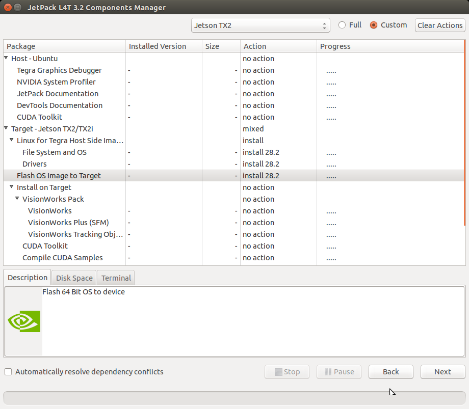

Installing a Jetson TX2 on a Jackal
=====================================
 
Start by opening up the Jackal to reveal the computer tray. Use the lever on the front of the jackal then the thumb screws on the lid. For more instructions refer to the `Jackal User's Manual <http://bit.ly/1f4hmqP>`_. 

Step 1: Remove mini-ITX Computer 
--------------------------------

(Skip this step if you don't have a computer)

If you have a mini-ITX computer installed it will need to be removed. With the computer tray open locate each of the cables connected to the motherboard and harddrive. Remove the power, power switch, USB and SATA cables. The two cable ties can be cut to completely remove the power and SATA cables. The two antenna cables are connected underneath. Keep this in mind for the next steps. 

.. image:: img1.JPG

Remove the four (4) hex screws from the motherboard using a 2.5mm wrench. Gently lift it out disconnecting the antenna connectors as you do so. 

.. image:: img2.JPG

Remove the zipties holding the USB header, power switch signal and antenna wire. The Jetson TX2 doesn't have a USB header so it will have to be replaced with a USB mini cable. You will need extra slack in both the antenna cable and power switch signal as well. 

.. image:: img3.JPG

Step 2: Install the TX2
------------------------
Install the Jetson TX2 using M3 screws or the screws removed from the computer. The holes will only line up in one orientation. Plug a USB mini cable from the Jetson to the Jackal MCU board. 

.. image:: img4.JPG 

This is beside where the USB header was removed if you had a computer. We recommend using a USB hub to increase the number of connected devices.  Plug the power switch cable into the power switch header (J6). If you wish to use the antenna cables attached to the Jackal remove the U.FL connectors from the Jetson module and connect the antenna cables. Caution: Take your time with this step the UF.L connectors are fragile.  If you wish not to disconnect the UF.L cables you can replace the antenna mounts on the Jackal with SMA extensions.

In order to power the Jetson make a cable which connects to the 12V user power to a barrel connector with center positive. Refer to the jackal manual for the pinout of the user power. We used one of the molex user power connectors. 

.. image:: img5.JPG 

**Warning:** Make sure not to plug this into the ITX power plug on the power distribution board.

Step 3: Installing the software
--------------------------------

On a Ubuntu machine download jetpack 3.2. 

`Download Jetpack <https://developer.nvidia.com/embedded/downloads#?search=jetpack%203.2>`_

`Jetpack Install Instructions <http://docs.nvidia.com/jetpack-l4t/3.2/index.html#developertools/mobile/jetpack/l4t/3.2/jetpack_l4t_install.htm>`_  

Follow the installation instructions from Nvidia to start the installer. Install at least the Linux for Tegra Host Side Image Setup. 

`Download the TX2 image <http://www.clearpathrobotics.com/downloads/3.2_jackal.img.bz2>`_ and place it into "{install directory}/64_TX2/Linux_for_Tegra_tx2/" Open a terminal and navigate to "{install directory}/64_TX2/Linux_for_Tegra_tx2/". Use pbzip2 to decompress the image. "pbzip2 -d {image name}.img.bz2". Pbzip2 is the parallel version of bzip2. Unziping can take some time. 

**Caution:** you will need 32 GB of free space for the image. Copy the uncompressed image and rename it to "bootloader/system.img".

Connect to the TX2 with a micro USB cable to the USB0 port. Power the TX2 either by turning on the Jackal or using the included power supply Next put the TX2 into recovery mode.

1.  Make sure the TX2 is powered off
2.  Press and hold the REC button
3.  Press the power button.

Then run "sudo ./flash.sh -r -k APP jetson-tx2 mmcblk0p1" on the host computer. this will copy the image file to the device. This is over USB2.0 so it will take some time. 

.. image:: flashcomplete.png

The TX2 will reboot and will have ROS Kinetic installed along with the Jackal drivers. Check to see that the Jackal is connected by opening a terminal and executing "rostopic echo /status". You should see a 1hz message containing the Jackal's diagnostic information.

If you would like to pair a PS4 controller to drive the Jackal, follow the bluez directions at: (https://docs.ubuntu.com/core/en/stacks/bluetooth/bluez/docs/reference/pairing/outbound). With the controller paired you should be able to control the jackal by pressing L1 and using the left stick to drive. For more information see the Jackal manual.

To use your host computer with the Jackal first install ROS (http://wiki.ros.org/kinetic/Installation) and setup a catkin workspace (http://wiki.ros.org/catkin/Tutorials/create_a_workspace). Clone the general Jackal repo and the desktop specific repo in to the src folder and compile it. Installing rosdeps if necessary with "rosdep install --from-paths src --ignore-src -r -y". https://github.com/jackal/jackal and https://github.com/jackal/jackal_desktop. Note the network ip of the TX2 and setup your host computer to use it as the master. http://wiki.ros.org/ROS/Tutorials/MultipleMachines

You can then run "roslaunch jackal_viz view_robot.launch" on your host machine.  You should see a model of the robot and be able to move the jackal using the interactive markers. See: http://www.clearpathrobotics.com/assets/guides/jackal/navigation.html
