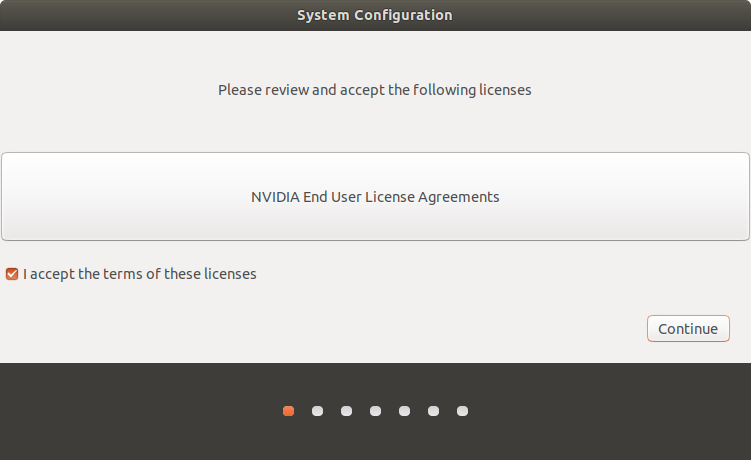
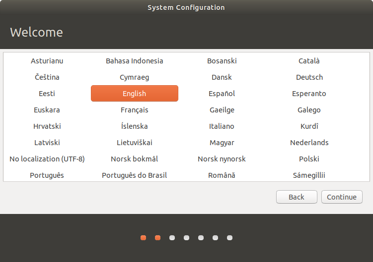
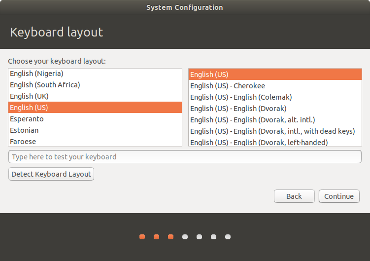
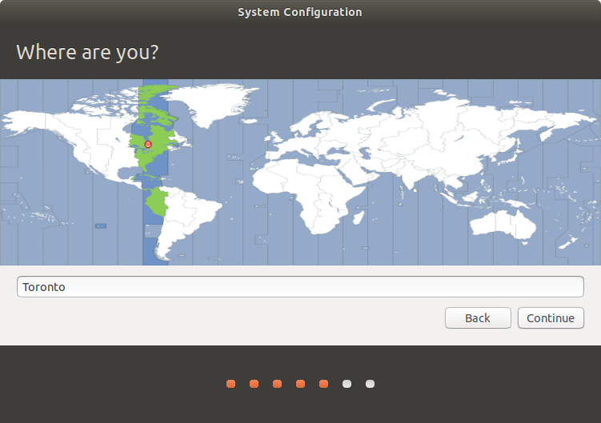
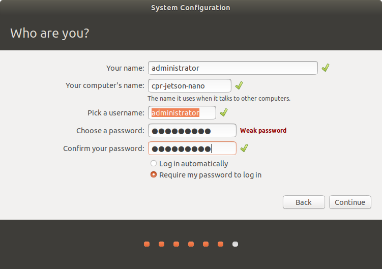
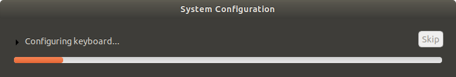
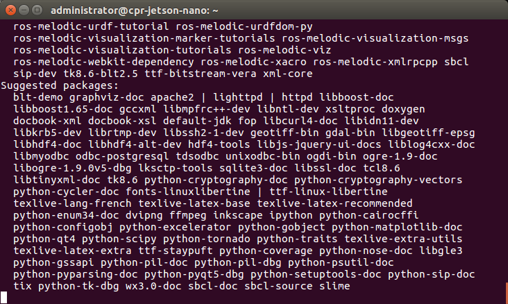

Installing a Jetson Nano
========================

.. warning::

    This page is a copy of the corresponding instructions from ROS Melodic.  At the time of writing Nvidia has not
    yet released support for Ubuntu 20.04 on Jetson platforms.  This means you cannot currently run ROS Noetic on
    a Jetson Nano.

    When Nvidia has released support for Ubuntu 20.04 we will remove this warning and update the instructions below
    as-necessary.

Start by opening up the Jackal to reveal the computer tray. Use the lever on the front of the Jackal then the thumb screws on the lid. For more instructions refer to the `Jackal User's Manual <http://bit.ly/1f4hmqP>`_.

Step 1: Remove mini-ITX Computer
--------------------------------

(Skip this step if you don't have a computer)

If you have a mini-ITX computer installed it will need to be removed. With the computer tray open locate each of the cables connected to the motherboard and harddrive. Remove the power, power switch, USB and SATA cables. The two cable ties can be cut to completely remove the power and SATA cables. The two antenna cables are connected underneath. Keep this in mind for the next steps.

.. image:: images/img1.JPG

Remove the four (4) hex screws from the motherboard using a 2.5mm wrench. Gently lift it out disconnecting the antenna connectors as you do so.

.. image:: images/img2.JPG

Remove the zipties holding the USB header, power switch signal and antenna wire. The Jetson Nano doesn't have a USB header so it will have to be replaced with a USB mini cable. You will need extra slack in both the antenna cable and power switch signal as well.

.. image:: images/img3.JPG

Remove the SSD from the outside of the computer tray.

Step 2: Install the Nano
------------------------
Custom mounting brackets are available `on Github <https://github.com/clearpathrobotics/jetson_setup/raw/melodic/models/JetsonNanoXavierJackalMount.stl>`_

Print this mount off using a 3D printer.  A 0.2mm layer thickness should be sufficient.

.. image:: images/Nano/Hardware/1.JPG

Add 4 M3 stand-offs to the board mount points.  A 6mm height is recommended.

.. image:: images/Nano/Hardware/2.JPG

Use M3 screws to fasten the Nano to the mount

.. image:: images/Nano/Hardware/3.JPG

Position the Nano with the mount over the rear two PEMs on the tray and fasten with M3x6 screws and washers

.. image:: images/Nano/Hardware/4.JPG

In order to power the Jetson make a cable which connects to the 12V user power to a barrel connector with center positive. Refer to the Jackal manual for the pinout of the user power. We used one of the molex user power connectors.

**Warning:** Make sure not to plug this into the ITX power plug on the power distribution board.

Step 3: Installing the Software
--------------------------------

Download the latest version of the `Nano SD Image <https://developer.nvidia.com/jetson-nano-sd-card-image>`_
Download the latest version of `Balena Etcher <https://www.balena.io/etcher/>`_

.. image:: images/Nano/Software/1.png

Use Etcher to flash the image onto your SD card

Once it is installed, connect the nano to a keyboard, monitor, and power supply.  Ubuntu needs to be setup first.  Agree to the Terms

Select your language.

Select your keyboard layout.

Select your locaiton.

Pick a hostname, username, and password for the machine.

.. note::

    For compatibility with older versions of the Jetson Nano software, set the username and password to ``nvidia``.
    To standardize with other Clearpath Robotics products, set the username to ``administrator`` and the password to ``clearpath``.

Specify the size for the partition.  The default size should fill the whole SD card.  Make sure it matches the maximum possible size, unless you have other plans for that space.

.. image:: images/Nano/Software/7.png

It will install the remainder of the required default packages.

Once the OS has been written to the Nano, log into it and run the following commands to configure it for use with Jackal:

.. code-block:: bash

    wget -c https://raw.githubusercontent.com/clearpathrobotics/ros_computer_setup/main/install.sh && bash install.sh

.. note::

    If ``curl`` is not installed on your Jetson by default you can install it by running ``sudo apt-get install curl``

These commands will download and install ROS along with the necessary APT packages to get Jackal up and running.  Depending on your network speed it may take a long time for everything to install.  Reboot the Nano after these commands are done to complete the configuration.

When the Jetson starts up again, it should be connected to the Jackal. To see that the Jackal is connected by opening a terminal and executing "rostopic echo /status". You should see a 1hz message containing the Jackal's diagnostic information.

Your Jetson Nano should now be configured to operate as the Jackal's main PC.

If you would like to pair a PS4 controller to drive the Jackal, hold down the PS and Share buttons on the controller until the light bar starts to flash. In a terminal on the Jackal, run ``bluetoothctl`` and then run the following commands:

.. code-block:: text

    agent on
    scan on
    < look for the MAC address of your controller; it will be identified by "Wireless Controller" or similar text >
    scan off
    pair <MAC ADDRESS>
    trust <MAC ADDRESS>
    connect <MAC ADDRESS>
    < ctrl + d to exit >

The light on the controller will turn solid blue once it is paired. With the controller paired you should be able to control the Jackal by pressing L1 and using the left stick to drive. For more information see the Jackal manual.

The light on the controller will turn solid blue once it is paired. With the controller paired you should be able to control the Jackal by pressing L1 and using the left stick to drive. For more information see the Jackal manual.

To use your host computer with the Jackal first `install ROS <http://wiki.ros.org/noetic/Installation>`_.  Once ROS is installed, install the Jackal packages with ``sudo apt install ros-noetic-jackal*``

Note the IP address of the Nano and `setup your host computer <http://wiki.ros.org/ROS/Tutorials/MultipleMachines>`_ to use it as the master.

You can then run ``roslaunch jackal_viz view_robot.launch`` on your host machine.  You should see a model of the robot and be able to move the Jackal using the interactive markers. See: :doc:`Navigating with Jackal <navigation>` for more information on using maps for navigation and localization.

The Nano will reboot and will have ROS Noetic installed along with the Jackal drivers.

To setup the Jetson to work with the Jackal, run ``bash ~/JACKAL_SETUP.sh`` on the Jetson and restart. When the Jetson starts up again, it should be connected to the Jackal. To see that the Jackal is connected by opening a terminal and executing "rostopic echo /status". You should see a 1hz message containing the Jackal's diagnostic information.

If you would like to pair a PS4 controller to drive the Jackal, hold down the PS and Share buttons on the controller until the light bar starts to flash. In a terminal on the Jackal, run ``sudo ds4drv-pair`` and wait for the controller to connect.  With the controller paired you should be able to control the Jackal by pressing L1 and using the left stick to drive. For more information see the Jackal manual.

To use your host computer with the Jackal first install ROS (http://wiki.ros.org/noetic/Installation) and setup a catkin workspace (http://wiki.ros.org/catkin/Tutorials/create_a_workspace). Clone the general Jackal repo and the desktop specific repo in to the src folder and compile it. Installing rosdeps if necessary with "rosdep install --from-paths src --ignore-src -r -y". https://github.com/jackal/jackal and https://github.com/jackal/jackal_desktop. Note the network ip of the Nano and setup your host computer to use it as the master. http://wiki.ros.org/ROS/Tutorials/MultipleMachines

You can then run "roslaunch jackal_viz view_robot.launch" on your host machine.  You should see a model of the robot and be able to move the Jackal using the interactive markers. See: http://www.clearpathrobotics.com/assets/guides/jackal/navigation.html
