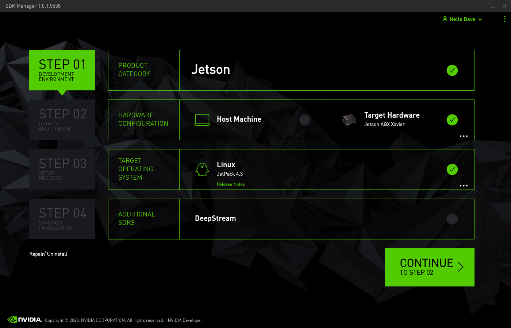
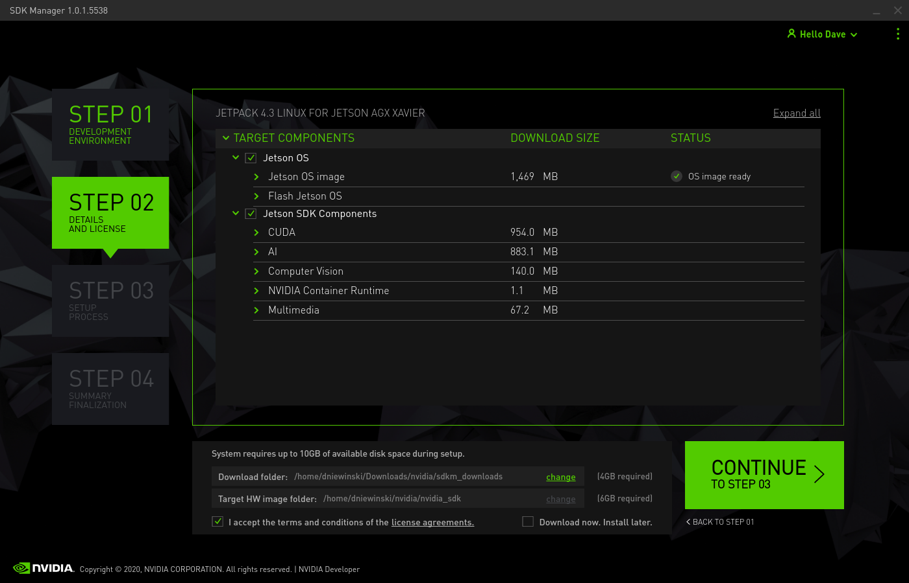
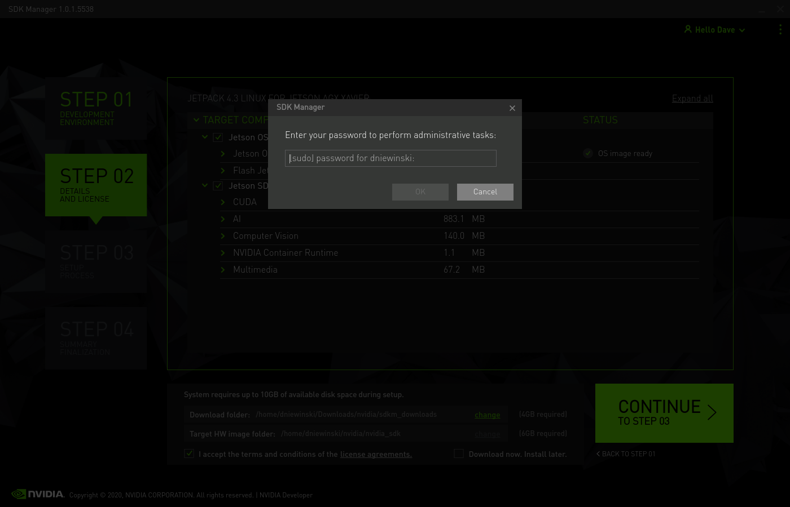
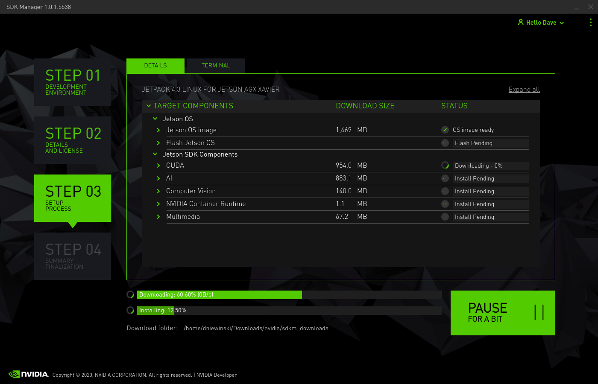
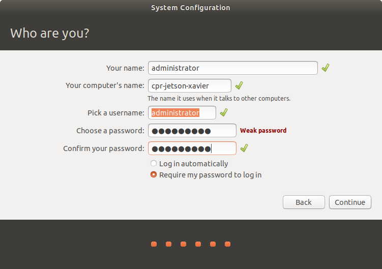
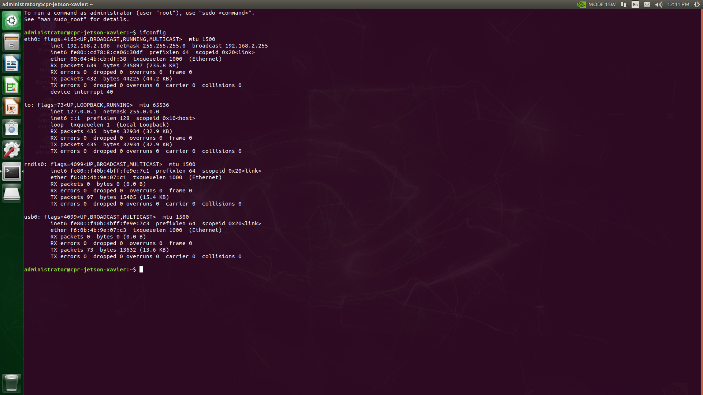
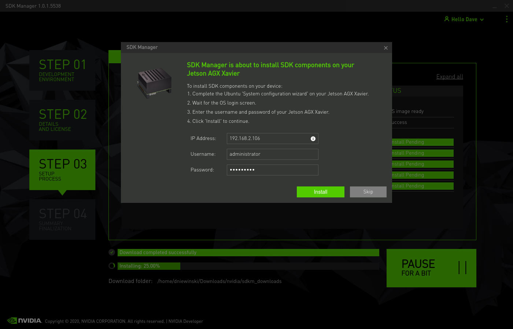
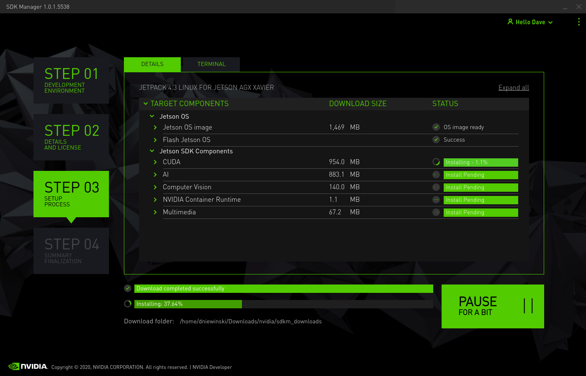
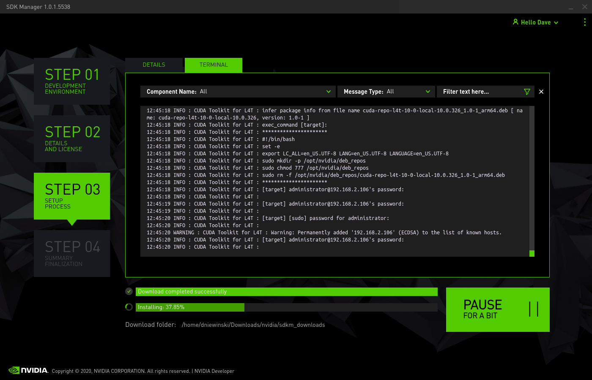
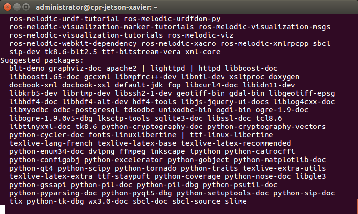

Installing a Jetson Xavier AGX
==============================

Start by opening up the Jackal to reveal the computer tray. Use the lever on the front of the Jackal then the thumb screws on the lid. For more instructions refer to the `Jackal User's Manual <http://bit.ly/1f4hmqP>`_.

Step 1: Remove mini-ITX Computer
--------------------------------

(Skip this step if you don't have a computer)

If you have a mini-ITX computer installed it will need to be removed. With the computer tray open locate each of the cables connected to the motherboard and harddrive. Remove the power, power switch, USB and SATA cables. The two cable ties can be cut to completely remove the power and SATA cables. The two antenna cables are connected underneath. Keep this in mind for the next steps.

.. image:: images/img1.JPG

Remove the four (4) hex screws from the motherboard using a 2.5mm wrench. Gently lift it out disconnecting the antenna connectors as you do so.

.. image:: images/img2.JPG

Remove the zipties holding the USB header, power switch signal and antenna wire. The Jetson Xavier doesn't have a USB header so it will have to be replaced with a USB mini cable. You will need extra slack in both the antenna cable and power switch signal as well.

.. image:: images/img3.JPG

Remove the SSD from the outside of the computer tray.

Step 2: Install the Xavier
--------------------------

Custom mounting brackets are available `on Github <https://github.com/clearpathrobotics/jetson_setup/raw/melodic/models/JetsonNanoXavierJackalMount.stl>`_

Print this mount off using a 3D printer.  A 0.2mm layer thickness should be sufficient.

.. image:: images/Xavier/Hardware/1.JPG

Use an allen wrench to remove the support feet from the bottom of the Xavier board by removing the M3 bolts. Place the feet on the 3D printed mount.

.. image:: images/Xavier/Hardware/2.JPG

Attach the Xavier to the mount using four m3x40 screws through the bottom of the mount in the holes for Xavier.

.. image:: images/Xavier/Hardware/3.JPG

Position the mount with the Xavier over the rear two PEMs on the tray and fasten with m3x6 screws and washers

.. image:: images/Xavier/Hardware/4.JPG

In order to power the Jetson make a cable which connects to the 12V user power to a barrel connector with center positive. Refer to the Jackal manual for the pinout of the user power. We used one of the molex user power connectors.

**Warning:** Make sure not to plug this into the ITX power plug on the power distribution board.

Step 3: Installing the Software
--------------------------------

`Download the latest version of Nvidia's SDK Manager <https://developer.nvidia.com/nvidia-sdk-manager>`_ on a PC running Ubuntu 18.04.  While that's downloading, put the Xavier into reovery mode by following these steps:

1.  Use the included USB cable to connect the Linux host computer to the front USB Type-C connector on the developer kit.
2.  Make sure the Xavier is powered off
3.  Connect a monitor, mouse, and keyboard to the Jetson.  (The mouse is optional, but recommended.  If you do not have an all-in-one mouse+keyboard you will need to use a small USB hub, as the Jetson Xavier only has a single USB port.)
4.  Press and hold the REC button
5.  Press the power button.

Install the SDK Manager by running the following commands:

.. code-block:: bash

    cd <folder where you downloaded SDK manager>
    sudo dpkg -i sdkmanager_<version>_amd64.deb

.. note::

    If your system is missing dependencies you may see error messages in the output of the ``dpkg`` command.  To resolve these, run ``sudo apt-get -f install``.

Login the the SDK Manager using your NVIDIA developer credentials.

.. image:: images/Xavier/Software/1.png

You do not need to setup your Host Machine unless you are planning on doing Cuda work on your local computer.  This can usually be disabled.  Under the Target Hardware, make sure to choose Xavier.

Click Next and accept the terms.  Make sure the Download and Target directories are in locations that you have write-access to and that your hard drive has enough space for the files.

Enter your sudo password

The SDK manager will download the necessary files and install the image on the Jetson.

During the install, make sure to plug a keyboard and monitor into the Jetson. On first boot, it will go through the usual Ubuntu setup steps.  Accept the Licenses

.. image:: images/Xavier/Software/6.png

Choose your language

.. image:: images/Xavier/Software/7.png

Choose your keyboard layout

.. image:: images/Xavier/Software/8.png

Set your location.

.. image:: images/Xavier/Software/9.png

Pick a hostname, username, and password for the machine.

.. note::

    For compatibility with older versions of the Jetson Xavier software, set the username and password to ``nvidia``.
    To standardize with other Clearpath Robotics products, set the username to ``administrator`` and the password to ``clearpath``.

It will complete the installation and install the remaining standard packages.

.. image:: images/Xavier/Software/11.png

Once the OS is setup, you will be brought to the desktop.

.. image:: images/Xavier/Software/12.png

Open a terminal and run ``ifconfig`` to see the IP address it is using.  You will need to connect it to network through wireless or ethernet.

Back in your host machine, it will be waiting to install the extra SDK components on your Jetson.  Enter the username, password, and IP address you found above.

The install will connenct to the remote Jetson over the network.  It will continue the install by transferring the files and install them.

You can check the terminal window to see the progress of individual commands.  This process will take a while, so it can be nice to verify that the process isn't stalled.

Once the process is done, you can click FINISH to close the window.

.. image:: images/Xavier/Software/17.png

Once the OS has been written to the Xavier, log into it and run the following commands to configure it for use with Jackal:

.. code-block:: bash

    curl -s https://raw.githubusercontent.com/clearpathrobotics/jetson_setup/melodic/scripts/xavier_setup.sh | bash -s --
    bash JACKAL_SETUP.sh

.. note::

    If ``curl`` is not installed on your Jetson by default you can install it by running ``sudo apt-get install curl``

These commands will download and install ROS along with the necessary APT packages to get Jackal up and running.  Depending on your network speed it may take a long time for everything to install.  Reboot the Xavier after these commands are done to complete the configuration.

When the Jetson starts up again, it should be connected to the Jackal. To see that the Jackal is connected by opening a terminal and executing "rostopic echo /status". You should see a 1hz message containing the Jackal's diagnostic information.

Your Jetson Xavier should now be configured to operate as the Jackal's main PC.

If you would like to pair a PS4 controller to drive the Jackal, hold down the PS and Share buttons on the controller until the light bar starts to flash. In a terminal on the Jackal, run ``bluetoothctl`` and then run the following commands:

.. code-block:: text

    agent on
    scan on
    < look for the MAC address of your controller; it will be identified by "Wireless Controller" or similar text >
    scan off
    pair <MAC ADDRESS>
    trust <MAC ADDRESS>
    connect <MAC ADDRESS>
    < ctrl + d to exit >

The light on the controller will turn solid blue once it is paired. With the controller paired you should be able to control the Jackal by pressing L1 and using the left stick to drive. For more information see the Jackal manual.

To use your host computer with the Jackal first `install ROS <http://wiki.ros.org/melodic/Installation>`_.  Once ROS is installed, install the Jackal packages with ``sudo apt install ros-melodic-jackal*``

Note the IP address of the Xavier and `setup your host computer <http://wiki.ros.org/ROS/Tutorials/MultipleMachines>`_ to use it as the master.

You can then run ``roslaunch jackal_viz view_robot.launch`` on your host machine.  You should see a model of the robot and be able to move the Jackal using the interactive markers. See: :doc:`Navigating with Jackal <navigation>` for more information on using maps for navigation and localization.

The Xavier will reboot and will have ROS Kinetic installed along with the Jackal drivers.

.. note::
  Since this image was created, the ROS buildfarm has changed their package-signing key.  You will need to add the new one with:

  ``sudo apt-key adv --keyserver 'hkp://keyserver.ubuntu.com:80' --recv-key C1CF6E31E6BADE8868B172B4F42ED6FBAB17C654``

To setup the Jetson to work with the Jackal, run ``bash ~/JACKAL_SETUP.sh`` on the Jetson and restart. When the Jetson starts up again, it should be connected to the Jackal. To see that the Jackal is connected by opening a terminal and executing "rostopic echo /status". You should see a 1hz message containing the Jackal's diagnostic information.

If you would like to pair a PS4 controller to drive the Jackal, hold down the PS and Share buttons on the controller until the light bar starts to flash. In a terminal on the Jackal, run ``sudo ds4drv-pair`` and wait for the controller to connect.  With the controller paired you should be able to control the Jackal by pressing L1 and using the left stick to drive. For more information see the Jackal manual.

To use your host computer with the Jackal first install ROS (http://wiki.ros.org/melodic/Installation) and setup a catkin workspace (http://wiki.ros.org/catkin/Tutorials/create_a_workspace). Clone the general Jackal repo and the desktop specific repo in to the src folder and compile it. Installing rosdeps if necessary with "rosdep install --from-paths src --ignore-src -r -y". https://github.com/jackal/jackal and https://github.com/jackal/jackal_desktop. Note the network ip of the Xavier and setup your host computer to use it as the master. http://wiki.ros.org/ROS/Tutorials/MultipleMachines

You can then run "roslaunch jackal_viz view_robot.launch" on your host machine.  You should see a model of the robot and be able to move the Jackal using the interactive markers. See: http://www.clearpathrobotics.com/assets/guides/jackal/navigation.html
